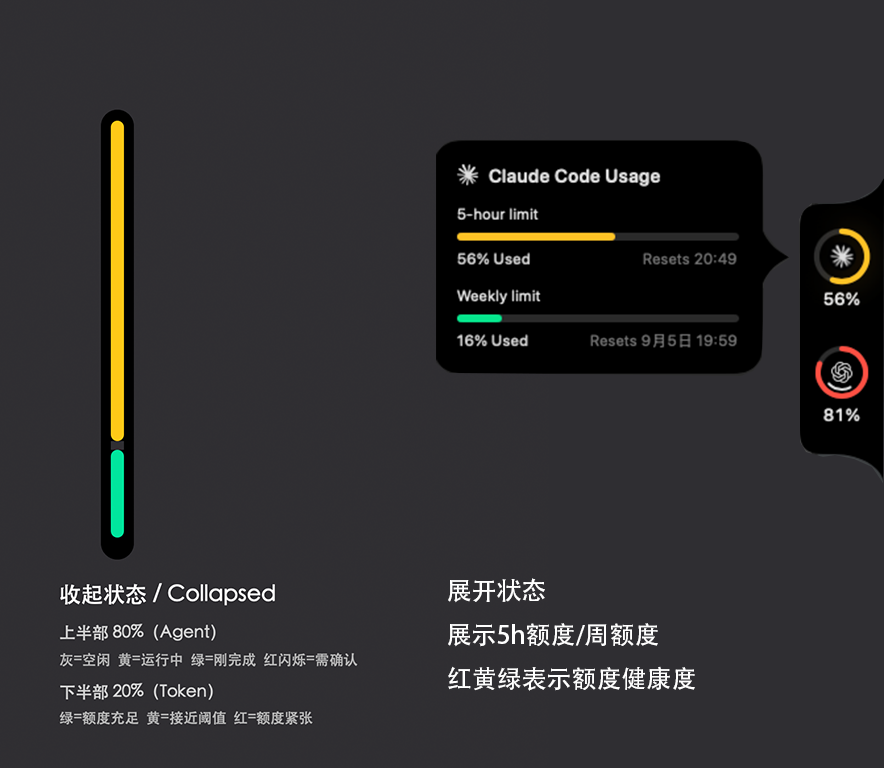

# AI 在跑什么、Token 还剩多少？一条 6px 侧边栏全告诉你

中文｜[English version](introducing-pulselight.en.md)

AI 任务放到后台运行以后，你通常要来回确认两件事：

**它还在工作吗？我还能用多少额度？**

PulseLight 把这两个答案合并到屏幕边缘的一条 6px 侧边栏里。它平时几乎隐形，需要时看一眼颜色，鼠标移入即可展开完整用量面板。

## 一眼看懂的 80 / 20

侧边栏分成两段，各自只负责一件事：

- **上方 80%：Agent 状态**
  - 灰色：空闲
  - 黄色：正在运行
  - 红色闪烁：等待确认或授权
  - 绿色：刚刚完成
- **下方 20%：Token 健康度**
  - 绿色：额度充足
  - 黄色：接近阈值，需要留意
  - 红色：额度紧张

Agent 状态占大部分，因为它决定你现在要不要回来处理；Token 变化更慢，用底部一小段持续提示就够了。

## 不用切窗口，也不会错过确认

PulseLight 同时关注 Claude Code 和 Codex。任务运行、等待授权、完成或空闲，都会直接反映在侧边栏上。

当多个终端同时工作时，只要有一个任务需要你确认，侧边栏就会优先显示提醒，不会被另一个已经完成的任务盖住。

## 鼠标移入，直接看到完整额度

不需要额外的菜单栏图标，也不需要再开一个监控窗口。鼠标移到侧边栏，Pulse 原来的额度面板就会展开：

- 多账号、多服务商用量
- 5 小时、周额度等不同窗口
- 已使用比例、剩余额度和重置时间
- 原有的圆环和详情卡片

收起时保持安静，展开时信息完整。侧边栏可以吸附在左侧、右侧或屏幕顶部。

## 现在就试试

PulseLight 是 macOS 应用，支持 Apple Silicon 和 macOS 14+。源码和安装包都在 GitHub：

<https://github.com/nishiwo/PulseLight>

它基于 [Pulse](https://github.com/qunqin24/Pulse)，并参考了 [AgLight](https://github.com/ryubyte/aglight) 的状态灯交互。

如果你也经常把 AI 任务丢到后台，PulseLight 希望帮你少切几次窗口，只用一眼就知道：**现在该不该回来，以及还能用多久。**
