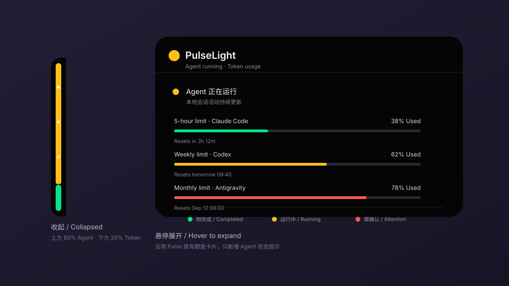

# 我把 Token 进度条和 AI 红绿灯，合成了一条 6px 的侧边栏

中文｜[English version](introducing-pulselight.en.md)

平时同时使用 Claude Code 和 Codex 时，我的桌面上常驻着两个小工具。

一个是 Pulse，用来显示各个 AI 账号的 Token 用量；另一个是 AgLight，用红绿灯告诉我 AI 是在运行、等待确认，还是刚刚完成。两个工具各自都很好用，但它们表达的其实是同一件事：**现在要不要关注 AI，以及还能用多久。**

于是我做了 PulseLight。

下面这张图按当前 SwiftUI 实现绘制，展示右侧吸边和鼠标移入后的展开状态。为了看清 6pt 吸边，收起状态在图中做了放大处理；它不是运行时截图。

## 为什么是 80 / 20

Pulse 原本会在不使用时缩成屏幕边缘的一条细线。这个状态很节省空间，但一整条颜色只能表达一件事。

我最后把它切成了两个区域：

- 上方 80% 显示 AI 状态；
- 下方 20% 保留 Token 用量状态。

AI 状态需要从余光里立刻识别，所以占据主体；Token 用量变化慢，只需要保留一个持续可见的提示。这样不用增加第二个菜单栏图标，也不用再放一个独立悬浮窗。

状态颜色很直接：

- 灰色：空闲；
- 黄色：正在运行；
- 红色闪烁：正在等待用户确认或授权；
- 绿色：任务刚刚完成，保留 8 秒。

底部 20% 继续使用 Pulse 的额度语义：绿色表示宽裕，黄色表示需要留意，红色表示已经比较紧张。

## 不只是把两个颜色拼起来

界面改动其实很小，真正需要认真处理的是状态来源。

Pulse 原来会读取 Claude Code 和 Codex 的本地会话记录，判断模型是否仍在工作。这个办法适合展示“运行中”，但很难准确捕获“正在等待授权”和“刚刚完成”。所以 PulseLight 还会安装本地 Hook，接收 `PermissionRequest`、`Stop`、`PreToolUse` 等事件。

Hook 调用的不是另一个后台服务，而是 PulseLight 自己的可执行文件。程序收到事件后只写入一条很小的本地状态记录，然后立即退出。这样不需要一直占用一个本地端口，也少了一个需要单独安装和维护的进程。

## 多任务不能互相覆盖

如果同时开着两个终端，一个任务完成，另一个任务正在等待授权，侧边栏应该是什么颜色？

简单保存“最后一个事件”会显示绿色，但这会把真正需要处理的红灯盖掉。PulseLight 按会话分别保存状态，再按优先级合并：

`等待确认 > 运行中 > 刚完成 > 空闲`

这样一个会话完成，不会覆盖另一个会话的授权请求。

## 修改配置时，先保证能退回去

Claude Code 和 Codex 的 Hook 配置里可能已经有用户自己的命令，所以 PulseLight 不会整体替换配置文件。它只移除和更新带有自身标记的 Hook，其他 Hook 原样保留。

第一次写入前还会生成 `.pulselight-backup` 备份。App 被移动到其他目录后，下次启动会自动修复 Hook 中的可执行文件路径。

这部分没有视觉效果，却是我最不愿意省略的实现：一个状态工具不应该为了显示一盏灯，破坏用户原来的开发环境。

## 保留 Pulse 原来的展开体验

PulseLight 没有重做 Pulse 已经成熟的部分。

鼠标移到侧边颜色条上，仍然会展开原来的多账号用量圆环和详情卡片；不同服务商的额度读取、重置时间、预测和账户管理也都保留。新的 80 / 20 颜色条只负责折叠状态，不改变面板尺寸和鼠标命中区域。

它仍然可以吸附在左侧、右侧或屏幕顶部。

## 下载与源码

项目源码：<https://github.com/nishiwo/PulseLight>

当前发布包支持 Apple Silicon，要求 macOS 14 或更高版本。下载 zip 后解压，将 `PulseLight.app` 放进 Applications 即可。

PulseLight 基于 [Pulse](https://github.com/qunqin24/Pulse) 修改，并参考了 [AgLight](https://github.com/ryubyte/aglight) 的状态灯交互。感谢两个项目的作者与贡献者。

如果你也经常把 AI 任务丢到后台运行，希望这条不起眼的 6px 侧边栏，能让你少切几次窗口。
