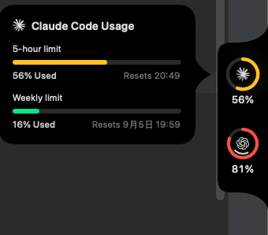
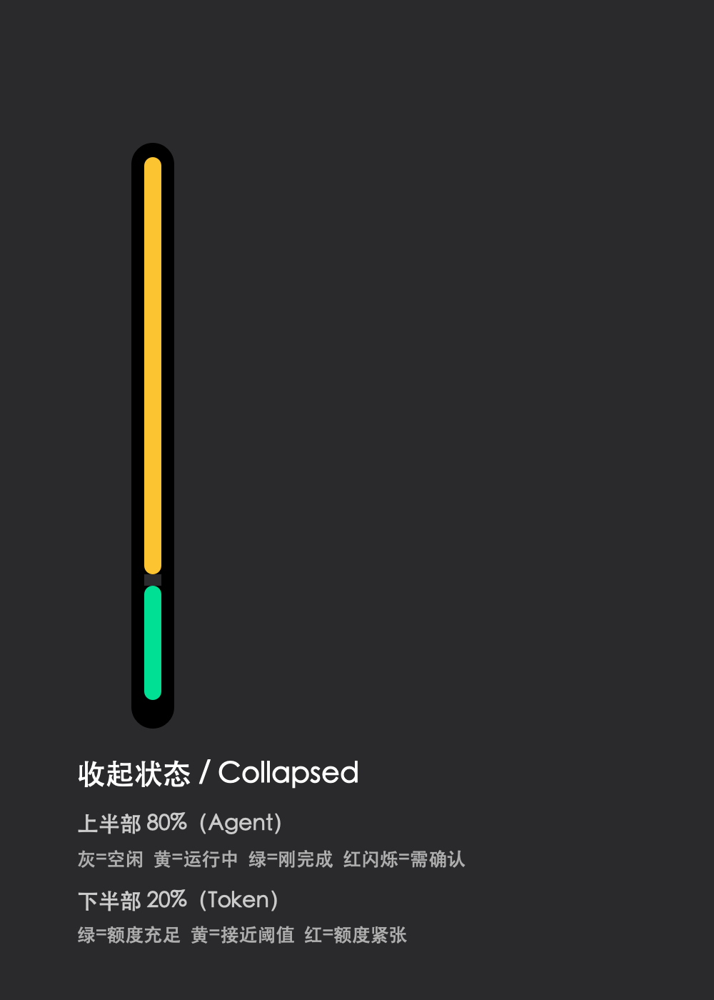

# PulseLight

中文｜[English](README.en.md)

一个贴在 macOS 屏幕边缘的 AI 状态与 Token 用量面板。

PulseLight 将 [Pulse](https://github.com/qunqin24/Pulse) 的多模型额度展示，和
[AgLight](https://github.com/ryubyte/aglight) 的 AI 运行状态思路合并为一个轻量应用：
平时只显示一条 6pt 的吸边颜色条，鼠标移入后展开完整用量面板。

展开状态直接使用真实运行截图，保持原始比例：



收起状态单独放大说明，不会压缩上面的真实截图：



## 80 / 20 吸边设计

| 区域 | 颜色 | 含义 |
| --- | --- | --- |
| 上方 80% | 灰色 | AI 空闲 |
| 上方 80% | 黄色 | AI 正在运行 |
| 上方 80% | 红色闪烁 | 等待用户确认或授权 |
| 上方 80% | 绿色 | AI 刚刚完成，保留 8 秒 |
| 下方 20% | 绿 / 黄 / 红 | 当前可见账号中最紧张的 Token 限额 |

额度颜色阈值：低于 50% 为绿色，50%–75% 为黄色，达到 75% 为红色。
左侧、右侧和顶部吸边均使用同一套比例。

## 特性

- 保留 Pulse 原有的多账号、多服务商用量圆环和详情卡片。
- 同时监听 Claude Code 与 Codex 的运行、授权和完成事件。
- 按会话分别保存状态，避免一个任务完成后覆盖另一个仍在等待授权的任务。
- Hook 只在本机调用 PulseLight 自身，不启动额外 HTTP 服务。
- 合并配置时保留现有 Hook，并在首次修改前创建 `.pulselight-backup` 备份。
- 使用独立的 App 名称、Bundle ID、缓存目录与登录启动项，不覆盖原 Pulse。

## 安装

从仓库的 Releases 下载 `PulseLight-1.0.7.zip`，解压后将 `PulseLight.app` 放进
`Applications` 并启动。

当前提供的安装包为 Apple Silicon（arm64）版本，要求 macOS 14 或更高版本。
它使用本地临时签名，尚未经过 Apple Developer ID 公证；首次打开时可能需要在
“系统设置 → 隐私与安全性”中确认。

首次启动会把 PulseLight Hook 合并到：

- Claude Code：`~/.claude/settings.json`
- Codex：`~/.codex/hooks.json`

手动管理 Hook：

```bash
/Applications/PulseLight.app/Contents/MacOS/Pulse --install-agent-hooks
/Applications/PulseLight.app/Contents/MacOS/Pulse --uninstall-agent-hooks
```

## 本地构建

```bash
swift build -Xswiftc -swift-version -Xswiftc 6
./Scripts/check-localization.sh
./Scripts/bundle.sh --zip
```

安装完整 Xcode 时，打包脚本会生成 Intel + Apple Silicon 通用版本；只有 Command
Line Tools 时，会生成当前 Mac 架构的版本。

## 项目来源

PulseLight 基于 qunqin24 的 [Pulse](https://github.com/qunqin24/Pulse) 修改，核心的
额度读取、浮动面板和服务商支持来自 Pulse。AI 状态交互参考了 ryubyte 的
[AgLight](https://github.com/ryubyte/aglight) 设计思路。

感谢两个项目的作者与贡献者。具体修改见 [CHANGELOG.md](CHANGELOG.md) 和
[NOTICE](NOTICE)。

## License

本项目沿用 [Apache License 2.0](LICENSE)。
